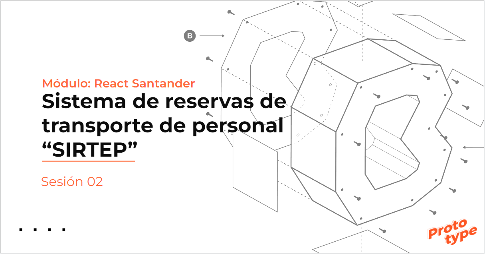

# BEDU: DESARROLLO WEB JAVASCRIPT FULLSTACK
---

## EQUIPO 13

---
## Resumen:

Proyecto "SIRTEP" es la solución en desarrollo para controlar el aforo y utilización del transporte de personal pensado para empresas y colegios, así como para los prestadores del servicio de transporte de personal, permitirá enfocar los esfuerzos administrativos para reducir costos, evitar pérdida de tiempo, controlar el aforo en los vehículos y además permitir tener una estadística -en caso de contagios por COVID-19- de los pasajeros que tuvieron contacto con alguna persona que resultó positiva al virus.

## Integrantes:

- Ángel Alberto Pimentel Méndez.
- Julio Alberto Hernández Godínez.
- Rodrigo Rosas Zamudio
- Sergio Monterrubio

## Enlaces:

- [Presentación](https://docs.google.com/presentation/d/1r7Mm6ty0Lj4CLH24z0i44MKPY-tzARPR5be-RMcBoDg/edit#slide=id.p1)

